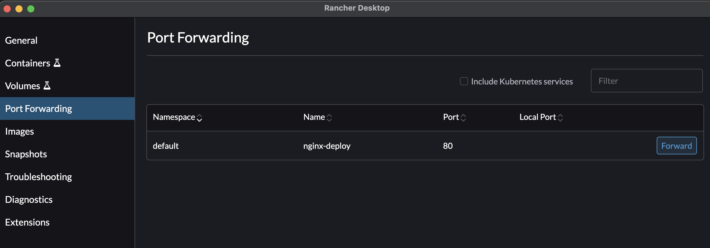
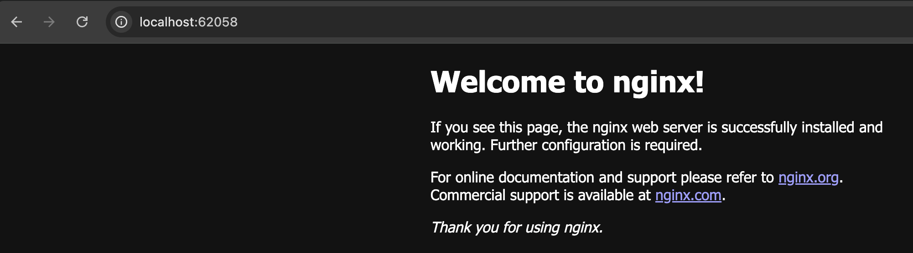

# Start K8S cluster local in MacOS

Using Rancher Desktop to start k8s cluster local

## Installation

Refer to [Rancher Desktop Documentation](https://docs.rancherdesktop.io/getting-started/installation/) for installation

## Quick start

### Config kubectl to point to the new cluster

Note: There is some error when copy the KubeConfig file from Rancher Desktop, run the command below to get the KubeConfig file for the cluster

```bash
export KUBECONFIG="/Users/congdat/.kube/config.d/local-rancher-config.yaml"
rdctl shell sudo k3s kubectl config view --raw > $KUBECONFIG
```

Export the `KUBECONFIG` variable in `.bashrc` or `.zshrc` to persist the config

Now, test the kubectl command

```bash
kubectl get node

NAME                   STATUS   ROLES                  AGE   VERSION
lima-rancher-desktop   Ready    control-plane,master   89d   v1.33.3+k3s1
```

### Setup port-forwarding

Create the Kubernetes service, then go the the Rancher Desktop -> Port Forwarding. Choose the k8s service you want to forward, then click Forward.



The Rancher Deskop will forward the traffic from `localhost:local-port` to k8s service

